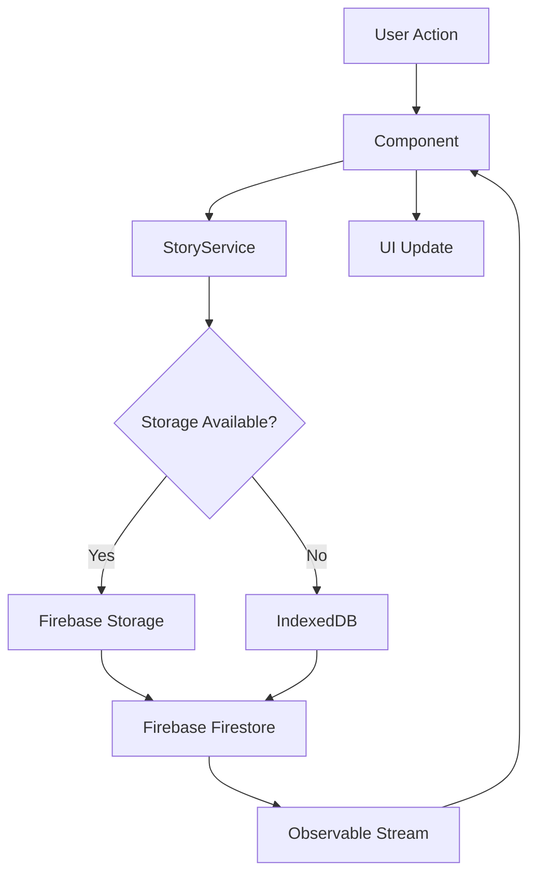

# Design Document: Travel Stories Tab

## Overview

The Travel Stories Tab feature adds a fifth tab to the existing Angular + Ionic application, providing Instagram-style story functionality for travel photos. Users can create story collections with cover images, add multiple photos to each story, and view them with automatic advancement and manual navigation controls.

The feature integrates with Firebase Storage for photo storage and Firebase Firestore for metadata management, with IndexedDB as a fallback storage mechanism when Firebase limitations are encountered. The design follows the existing service-based architecture pattern used in the application (as seen in FilmService and UserService).

### Key Design Decisions

1. **Service Layer Architecture**: Following the existing pattern, we'll create a `StoryService` that handles all Firebase interactions using Angular Fire's dependency injection pattern
2. **Storage Strategy**: Primary storage in Firebase Storage with automatic fallback to IndexedDB when storage limits are exceeded or uploads fail
3. **Component Structure**: Separate components for the main stories grid, story viewer, and photo management to maintain modularity
4. **State Management**: Use RxJS Observables for reactive data flow, consistent with existing services
5. **Image Optimization**: Client-side compression before upload to minimize storage usage and improve load times

## Architecture

### High-Level Component Structure

```
tab5/ (Travel Stories Tab)
├── tab5.page.ts/html/scss          # Main stories grid view
├── components/
│   ├── story-viewer/               # Fullscreen story viewer with auto-advance
│   ├── story-card/                 # Individual story cover card
│   ├── photo-uploader/             # Photo selection and upload UI
│   └── story-editor/               # Edit story title and cover
├── services/
│   ├── story.service.ts            # Firebase Firestore operations
│   ├── storage.service.ts          # Firebase Storage + IndexedDB fallback
│   └── image-optimizer.service.ts  # Image compression and optimization
└── models/
    ├── story.model.ts              # Story data structure
    └── photo.model.ts              # Photo metadata structure
```

### Data Flow



### Integration Points

1. **Tab Navigation**: Integrates with existing tabs-routing.module.ts
2. **Firebase**: Uses @angular/fire v19 (already in dependencies)
3. **Capacitor**: Leverages existing Capacitor setup for native photo picker
4. **Ionic Components**: Uses Ionic UI components for consistent styling

## Components and Interfaces

### 1. Tab5Page (Main Stories View)

**Responsibility**: Display grid of story covers, handle story creation and deletion

**Key Methods**:
- `ngOnInit()`: Load all stories from StoryService
- `createStory()`: Navigate to story creation flow
- `openStory(storyId)`: Navigate to StoryViewerComponent
- `deleteStory(storyId)`: Confirm and delete story with all photos
- `editStory(storyId)`: Open StoryEditorComponent

**Template Features**:
- Grid layout using `ion-grid` with responsive columns
- Empty state message when no stories exist
- Floating action button for creating new stories
- Pull-to-refresh for syncing with Firebase

### 2. StoryViewerComponent

**Responsibility**: Fullscreen photo viewing with auto-advance and manual navigation

**Key Properties**:
- `currentPhotoIndex: number`: Track current photo position
- `autoAdvanceTimer: Subscription`: Handle auto-advance timing
- `progressPercentage: number`: Progress bar state

**Key Methods**:
- `startAutoAdvance()`: Begin 5-second timer for next photo
- `pauseAutoAdvance()`: Stop timer during user interaction
- `nextPhoto()`: Advance to next photo or close if last
- `previousPhoto()`: Go back to previous photo
- `handleTap(event)`: Determine left/right tap for navigation
- `closeViewer()`: Return to main stories view

**Template Features**:
- Fullscreen photo display with `ion-img`
- Progress indicators for each photo
- Photo counter (e.g., "3 / 10")
- Tap zones for left/right navigation
- Close button overlay

### 3. StoryCardComponent

**Responsibility**: Display individual story cover in grid

**Inputs**:
- `@Input() story: Story`: Story data including cover URL and metadata

**Template Features**:
- Cover image with loading placeholder
- Story title overlay
- Photo count badge
- Long-press menu for edit/delete options

### 4. PhotoUploaderComponent

**Responsibility**: Handle photo selection, optimization, and upload

**Key Methods**:
- `selectPhotos()`: Open native photo picker (multiple selection)
- `optimizeImages(files)`: Compress images before upload
- `uploadPhotos(optimizedFiles)`: Upload to storage with progress tracking
- `handleUploadError(error)`: Retry logic and fallback to IndexedDB

**Template Features**:
- Upload progress indicators
- Photo count display ("Uploading 3 of 10")
- Error messages with retry button
- Success confirmation

### 5. StoryEditorComponent

**Responsibility**: Edit story title and cover image

**Key Methods**:
- `loadStory(storyId)`: Fetch current story data
- `updateTitle(newTitle)`: Save title changes
- `changeCover()`: Select and upload new cover image
- `saveChanges()`: Persist updates to Firestore

## Data Models

### Story Model

```typescript
export interface Story {
  id: string;                    // Firestore document ID
  title: string;                 // User-defined story title
  coverUrl: string;              // URL to cover image (Firebase or IndexedDB)
  coverStorageType: 'firebase' | 'indexeddb';  // Storage location
  photoCount: number;            // Number of photos in story
  createdAt: Date;               // Creation timestamp
  updatedAt: Date;               // Last modification timestamp
  photos: Photo[];               // Array of photo metadata
}
```

### Photo Model

```typescript
export interface Photo {
  id: string;                    // Unique photo identifier
  url: string;                   // URL to full-size image
  thumbnailUrl?: string;         // Optional thumbnail URL
  storageType: 'firebase' | 'indexeddb';  // Storage location
  order: number;                 // Display order in story
  uploadedAt: Date;              // Upload timestamp
  size: number;                  // File size in bytes
}
```

### Upload Progress Model

```typescript
export interface UploadProgress {
  photoId: string;
  fileName: string;
  progress: number;              // 0-100 percentage
  status: 'pending' | 'uploading' | 'complete' | 'error';
  error?: string;
}
```

## Services

### StoryService

**Purpose**: Manage story metadata in Firebase Firestore

**Key Methods**:

```typescript
class StoryService {
  getAll(): Observable<Story[]>              // Fetch all stories, sorted by createdAt desc
  get(id: string): Observable<Story>         // Fetch single story by ID
  create(story: Partial<Story>): Promise<string>  // Create new story, return ID
  update(story: Story): Promise<void>        // Update story metadata
  delete(id: string): Promise<void>          // Delete story and trigger photo cleanup
  reorderPhotos(storyId: string, photoIds: string[]): Promise<void>  // Update photo order
}
```

**Implementation Notes**:
- Follows existing service pattern (inject Firestore, use collection/doc helpers)
- Uses `collectionData` with `idField: 'id'` for automatic ID mapping
- Implements error handling with retry logic for network failures

### StorageService

**Purpose**: Handle photo uploads to Firebase Storage with IndexedDB fallback

**Key Methods**:

```typescript
class StorageService {
  uploadPhoto(file: Blob, path: string): Observable<UploadProgress>  // Upload with progress
  downloadPhoto(url: string): Promise<Blob>                          // Download for caching
  deletePhoto(url: string, storageType: StorageType): Promise<void>  // Remove from storage
  checkStorageQuota(): Promise<StorageQuota>                         // Check Firebase quota
  saveToIndexedDB(file: Blob, key: string): Promise<string>          // Fallback storage
  getFromIndexedDB(key: string): Promise<Blob>                       // Retrieve from fallback
  clearCache(): Promise<void>                                        // Clear local cache
}
```

**Storage Strategy**:
1. Attempt Firebase Storage upload first
2. If quota exceeded or upload fails after retries, use IndexedDB
3. Store `storageType` in photo metadata for retrieval
4. Implement LRU cache for frequently accessed images

**IndexedDB Schema**:
```typescript
// Database: 'travel-stories'
// Object Store: 'photos'
interface IndexedDBPhoto {
  key: string;        // Unique identifier
  blob: Blob;         // Image data
  timestamp: Date;    // For cache management
  size: number;       // File size
}
```

### ImageOptimizerService

**Purpose**: Compress and optimize images before upload

**Key Methods**:

```typescript
class ImageOptimizerService {
  compressImage(file: File, maxWidth: number, quality: number): Promise<Blob>
  generateThumbnail(file: File, size: number): Promise<Blob>
  validateImage(file: File): boolean  // Check file type and size
  getImageDimensions(file: File): Promise<{width: number, height: number}>
}
```

**Optimization Strategy**:
- Resize images to max 1920px width while maintaining aspect ratio
- Compress to 85% quality (balance between size and visual quality)
- Generate 300px thumbnails for story covers
- Convert to WebP format if browser supports it
- Reject files larger than 10MB before optimization

## Correctness Properties

*A property is a characteristic or behavior that should hold true across all valid executions of a system-essentially, a formal statement about what the system should do. Properties serve as the bridge between human-readable specifications and machine-verifiable correctness guarantees.*


### Property 1: Story Metadata Round-Trip

*For any* story with metadata (title, cover, creation date, photo count), saving the story to Firebase and then retrieving it should return equivalent metadata values.

**Validates: Requirements 3.5, 8.3, 11.4, 12.3**

### Property 2: Photo Metadata Persistence

*For any* photo uploaded with metadata (URL, order, timestamp), the metadata should be retrievable from Firebase Database after upload completes.

**Validates: Requirements 4.5, 8.4**

### Property 3: Story Display Ordering

*For any* collection of stories with different creation timestamps, the displayed stories should be sorted in reverse chronological order (newest first).

**Validates: Requirements 2.4**

### Property 4: Story Cover Display Completeness

*For any* set of stories loaded in the tab, each story should have its cover image rendered in the grid.

**Validates: Requirements 2.1, 2.3**

### Property 5: Story Selection Navigation

*For any* story cover that is tapped, the application should navigate to the Story Viewer displaying that specific story's photos.

**Validates: Requirements 2.5**

### Property 6: Unique Story Identifiers

*For any* newly created story, the assigned identifier should be unique and not conflict with existing story IDs.

**Validates: Requirements 3.3**

### Property 7: Upload to Storage

*For any* photo or cover image selected for upload, the application should attempt to store it in Firebase Storage or IndexedDB fallback.

**Validates: Requirements 4.4, 8.1, 8.2**

### Property 8: Image Caching

*For any* image downloaded from Firebase Storage, the image data should be available in the local cache for subsequent offline access.

**Validates: Requirements 8.6**

### Property 9: Story Deletion Cleanup

*For any* story that is deleted, all associated photos should be removed from storage and all metadata should be removed from the database.

**Validates: Requirements 10.2, 10.3**

### Property 10: Photo Deletion Cleanup

*For any* individual photo that is deleted from a story, the photo should be removed from storage and the story's photo metadata should be updated to exclude it.

**Validates: Requirements 10.5**

### Property 11: Deletion Confirmation

*For any* deletion operation (story or photo), a confirmation dialog should be displayed before the deletion is executed.

**Validates: Requirements 10.6**

### Property 12: Single Photo Display

*For any* point in time while viewing a story, exactly one photo should be displayed in fullscreen mode.

**Validates: Requirements 5.2**

### Property 13: Photo Counter Accuracy

*For any* photo being viewed in a story, the displayed counter should show the correct current position and total count (e.g., "3 / 10").

**Validates: Requirements 5.3, 5.4**

### Property 14: Auto-Advance Timing

*For any* photo in the story viewer, if no user interaction occurs, the viewer should automatically advance to the next photo after the configured duration (default 5 seconds).

**Validates: Requirements 6.1**

### Property 15: Timer Reset on Interaction

*For any* manual navigation action (tap left/right), the auto-advance timer should reset and restart from zero.

**Validates: Requirements 6.4, 7.5**

### Property 16: Progress Bar Accuracy

*For any* photo being displayed with auto-advance enabled, the progress bar should accurately reflect the remaining time before advancing.

**Validates: Requirements 6.5**

### Property 17: Manual Navigation

*For any* photo in a story (except boundary cases), tapping the right half should advance to the next photo and tapping the left half should go to the previous photo.

**Validates: Requirements 7.1, 7.2**

### Property 18: Photo Reordering Persistence

*For any* reordering of photos within a story, the new order should be saved to Firebase Database and reflected when the story is viewed again.

**Validates: Requirements 12.3**

### Property 19: Image Compression

*For any* photo uploaded to the system, the image should be compressed before storage to reduce file size.

**Validates: Requirements 13.1**

### Property 20: Thumbnail Generation

*For any* story cover image uploaded, a thumbnail version should be generated and stored.

**Validates: Requirements 13.3**

### Property 21: Loading Indicators

*For any* asynchronous operation (image fetch, upload, sync), an appropriate loading indicator should be displayed while the operation is in progress.

**Validates: Requirements 13.5, 15.1, 15.3**

### Property 22: Upload Progress Display

*For any* multi-photo upload operation, the UI should display the current count and total count of photos being uploaded (e.g., "Uploading 3 of 10").

**Validates: Requirements 15.5**

### Property 23: Error Handling Display

*For any* error that occurs (upload failure, loading failure, unexpected error), an appropriate error message should be displayed to the user.

**Validates: Requirements 14.2, 14.3, 14.5**

### Property 24: Upload Retry on Failure

*For any* photo upload that fails, the application should provide a retry option to attempt the upload again.

**Validates: Requirements 4.6, 14.2**

## Error Handling

### Error Categories and Strategies

#### 1. Network Errors

**Scenarios**:
- Firebase connection timeout
- Intermittent connectivity during upload/download
- Complete offline state

**Handling Strategy**:
- Implement exponential backoff retry (3 attempts: 1s, 2s, 4s delays)
- Display connection status indicator in UI
- Queue operations for retry when connection restored
- Provide manual retry button for user control
- Cache data locally for offline viewing

**User Feedback**:
- Toast notification: "Connection lost. Retrying..."
- Persistent banner for extended offline periods
- Success notification when connection restored

#### 2. Storage Errors

**Scenarios**:
- Firebase Storage quota exceeded
- IndexedDB quota exceeded
- File size exceeds limits
- Unsupported file format

**Handling Strategy**:
- Check Firebase quota before upload using Storage API
- Automatically fallback to IndexedDB when Firebase quota exceeded
- Compress images more aggressively if initial upload fails
- Validate file type and size before processing
- Implement storage cleanup for old cached images

**User Feedback**:
- Alert dialog: "Storage limit reached. Using local storage for this photo."
- Warning when approaching quota limits
- Option to clear cache to free space

#### 3. Data Integrity Errors

**Scenarios**:
- Corrupted image data
- Missing metadata fields
- Orphaned photos (story deleted but photos remain)
- Inconsistent photo order

**Handling Strategy**:
- Validate data structure before saving to Firestore
- Implement cascade delete for story removal
- Run periodic cleanup job to remove orphaned data
- Use transactions for multi-step operations
- Maintain referential integrity between stories and photos

**User Feedback**:
- Generic error message for corrupted data
- Automatic cleanup runs silently in background
- Log errors for debugging without exposing to user

#### 4. User Input Errors

**Scenarios**:
- Empty story title
- No photos selected
- Invalid image format
- Duplicate story names

**Handling Strategy**:
- Client-side validation before submission
- Provide clear validation messages
- Disable submit buttons until valid input
- Accept duplicate names (use timestamp for uniqueness)

**User Feedback**:
- Inline validation messages
- Disabled state with tooltip explanation
- Form field highlighting for errors

#### 5. Permission Errors

**Scenarios**:
- Photo picker access denied
- Firebase authentication failure
- Insufficient storage permissions

**Handling Strategy**:
- Request permissions before attempting operations
- Provide clear explanation of why permissions needed
- Graceful degradation if permissions denied
- Link to device settings for permission management

**User Feedback**:
- Alert dialog explaining permission requirement
- Button to open device settings
- Alternative workflows if possible

### Error Recovery Mechanisms

#### Automatic Recovery
- Retry failed uploads automatically (up to 3 times)
- Resume interrupted uploads from last checkpoint
- Sync local changes when connection restored
- Validate and repair data inconsistencies on app start

#### Manual Recovery
- "Retry" button for failed operations
- "Clear cache and reload" option for persistent issues
- "Report problem" button to log detailed error info
- Export/import functionality for data backup

### Error Logging

**Client-Side Logging**:
- Log all errors to browser console in development
- Use structured logging with error codes
- Include context: user action, component, timestamp
- Sanitize sensitive data before logging

**Error Codes**:
```typescript
enum ErrorCode {
  NETWORK_TIMEOUT = 'NET_001',
  STORAGE_QUOTA_EXCEEDED = 'STR_001',
  FIREBASE_QUOTA_EXCEEDED = 'STR_002',
  INVALID_IMAGE_FORMAT = 'IMG_001',
  IMAGE_TOO_LARGE = 'IMG_002',
  PERMISSION_DENIED = 'PRM_001',
  DATA_CORRUPTION = 'DAT_001',
  UNKNOWN_ERROR = 'UNK_001'
}
```

## Testing Strategy

### Dual Testing Approach

The testing strategy employs both unit tests and property-based tests to ensure comprehensive coverage:

- **Unit Tests**: Verify specific examples, edge cases, error conditions, and integration points
- **Property-Based Tests**: Verify universal properties across all inputs through randomized testing

Both approaches are complementary and necessary. Unit tests catch concrete bugs in specific scenarios, while property-based tests verify general correctness across a wide range of inputs.

### Unit Testing

**Framework**: Jasmine + Karma (already configured in project)

**Focus Areas**:
1. **Component Integration**: Test interactions between components
2. **Edge Cases**: Boundary conditions identified in requirements
3. **Error Scenarios**: Specific error conditions and recovery
4. **UI Interactions**: User flows and navigation

**Example Unit Tests**:

```typescript
describe('StoryViewerComponent', () => {
  it('should remain on first photo when tapping left', () => {
    // Edge case: 7.3
    component.currentPhotoIndex = 0;
    component.handleTap({ clientX: 50 }); // Left side tap
    expect(component.currentPhotoIndex).toBe(0);
  });

  it('should close viewer when tapping right on last photo', () => {
    // Edge case: 7.4
    component.currentPhotoIndex = component.photos.length - 1;
    component.handleTap({ clientX: 350 }); // Right side tap
    expect(component.viewerClosed).toBe(true);
  });

  it('should display empty state when no stories exist', () => {
    // Example: 2.2
    component.stories = [];
    fixture.detectChanges();
    const emptyState = fixture.nativeElement.querySelector('.empty-state');
    expect(emptyState).toBeTruthy();
  });
});

describe('StorageService', () => {
  it('should fallback to IndexedDB when Firebase quota exceeded', () => {
    // Error scenario: 14.4
    spyOn(firebaseStorage, 'upload').and.returnError('quota-exceeded');
    service.uploadPhoto(mockFile, 'path').subscribe(result => {
      expect(result.storageType).toBe('indexeddb');
    });
  });
});
```

### Property-Based Testing

**Framework**: fast-check (TypeScript property-based testing library)

**Configuration**:
- Minimum 100 iterations per property test
- Each test tagged with reference to design document property
- Tag format: `Feature: travel-stories-tab, Property {number}: {property_text}`

**Installation**:
```bash
npm install --save-dev fast-check
```

**Property Test Examples**:

```typescript
import * as fc from 'fast-check';

describe('Property Tests: Story Management', () => {
  
  // Feature: travel-stories-tab, Property 1: Story Metadata Round-Trip
  it('should preserve story metadata through save and retrieve cycle', () => {
    fc.assert(
      fc.property(
        fc.record({
          title: fc.string({ minLength: 1, maxLength: 100 }),
          coverUrl: fc.webUrl(),
          photoCount: fc.nat(50),
          createdAt: fc.date()
        }),
        async (storyData) => {
          const savedId = await storyService.create(storyData);
          const retrieved = await firstValueFrom(storyService.get(savedId));
          
          expect(retrieved.title).toBe(storyData.title);
          expect(retrieved.coverUrl).toBe(storyData.coverUrl);
          expect(retrieved.photoCount).toBe(storyData.photoCount);
        }
      ),
      { numRuns: 100 }
    );
  });

  // Feature: travel-stories-tab, Property 3: Story Display Ordering
  it('should display stories in reverse chronological order', () => {
    fc.assert(
      fc.property(
        fc.array(
          fc.record({
            id: fc.uuid(),
            title: fc.string(),
            createdAt: fc.date()
          }),
          { minLength: 2, maxLength: 20 }
        ),
        (stories) => {
          const sorted = component.sortStories(stories);
          
          for (let i = 0; i < sorted.length - 1; i++) {
            expect(sorted[i].createdAt.getTime())
              .toBeGreaterThanOrEqual(sorted[i + 1].createdAt.getTime());
          }
        }
      ),
      { numRuns: 100 }
    );
  });

  // Feature: travel-stories-tab, Property 6: Unique Story Identifiers
  it('should generate unique IDs for all created stories', () => {
    fc.assert(
      fc.property(
        fc.array(
          fc.record({
            title: fc.string(),
            coverUrl: fc.webUrl()
          }),
          { minLength: 2, maxLength: 50 }
        ),
        async (storyDataArray) => {
          const ids = await Promise.all(
            storyDataArray.map(data => storyService.create(data))
          );
          
          const uniqueIds = new Set(ids);
          expect(uniqueIds.size).toBe(ids.length);
        }
      ),
      { numRuns: 100 }
    );
  });

  // Feature: travel-stories-tab, Property 13: Photo Counter Accuracy
  it('should display accurate photo counter for any position', () => {
    fc.assert(
      fc.property(
        fc.array(fc.record({ id: fc.uuid(), url: fc.webUrl() }), { minLength: 1, maxLength: 50 }),
        fc.nat(),
        (photos, seed) => {
          component.photos = photos;
          const index = seed % photos.length;
          component.currentPhotoIndex = index;
          
          const counter = component.getPhotoCounter();
          expect(counter).toBe(`${index + 1} / ${photos.length}`);
        }
      ),
      { numRuns: 100 }
    );
  });

  // Feature: travel-stories-tab, Property 17: Manual Navigation
  it('should navigate correctly for any non-boundary photo', () => {
    fc.assert(
      fc.property(
        fc.array(fc.record({ id: fc.uuid() }), { minLength: 3, maxLength: 50 }),
        fc.nat(),
        (photos, seed) => {
          component.photos = photos;
          const index = (seed % (photos.length - 2)) + 1; // Avoid boundaries
          component.currentPhotoIndex = index;
          
          // Test right tap
          component.handleTap({ clientX: 350 });
          expect(component.currentPhotoIndex).toBe(index + 1);
          
          // Test left tap
          component.handleTap({ clientX: 50 });
          expect(component.currentPhotoIndex).toBe(index);
        }
      ),
      { numRuns: 100 }
    );
  });

  // Feature: travel-stories-tab, Property 19: Image Compression
  it('should compress any uploaded image', () => {
    fc.assert(
      fc.property(
        fc.record({
          width: fc.integer({ min: 500, max: 5000 }),
          height: fc.integer({ min: 500, max: 5000 }),
          size: fc.integer({ min: 1000000, max: 10000000 }) // 1-10 MB
        }),
        async (imageData) => {
          const mockFile = createMockImage(imageData);
          const compressed = await imageOptimizer.compressImage(mockFile, 1920, 0.85);
          
          expect(compressed.size).toBeLessThan(mockFile.size);
        }
      ),
      { numRuns: 100 }
    );
  });
});

describe('Property Tests: Error Handling', () => {
  
  // Feature: travel-stories-tab, Property 23: Error Handling Display
  it('should display error message for any error type', () => {
    fc.assert(
      fc.property(
        fc.oneof(
          fc.constant('network-error'),
          fc.constant('storage-error'),
          fc.constant('permission-error'),
          fc.constant('unknown-error')
        ),
        (errorType) => {
          component.handleError(new Error(errorType));
          fixture.detectChanges();
          
          const errorMessage = fixture.nativeElement.querySelector('.error-message');
          expect(errorMessage).toBeTruthy();
          expect(errorMessage.textContent.length).toBeGreaterThan(0);
        }
      ),
      { numRuns: 100 }
    );
  });

  // Feature: travel-stories-tab, Property 9: Story Deletion Cleanup
  it('should remove all photos when deleting any story', () => {
    fc.assert(
      fc.property(
        fc.record({
          id: fc.uuid(),
          title: fc.string(),
          photos: fc.array(
            fc.record({ id: fc.uuid(), url: fc.webUrl() }),
            { minLength: 1, maxLength: 20 }
          )
        }),
        async (story) => {
          await storyService.create(story);
          await storyService.delete(story.id);
          
          // Verify story is gone
          const stories = await firstValueFrom(storyService.getAll());
          expect(stories.find(s => s.id === story.id)).toBeUndefined();
          
          // Verify all photos are gone
          for (const photo of story.photos) {
            const exists = await storageService.checkExists(photo.url);
            expect(exists).toBe(false);
          }
        }
      ),
      { numRuns: 100 }
    );
  });
});
```

### Test Coverage Goals

- **Unit Test Coverage**: Minimum 80% code coverage
- **Property Test Coverage**: All 24 correctness properties implemented
- **Integration Test Coverage**: All critical user flows (create story, add photos, view story, delete story)
- **E2E Test Coverage**: Complete user journey from app launch to story viewing

### Testing Best Practices

1. **Isolation**: Mock Firebase services in unit tests to avoid external dependencies
2. **Determinism**: Use fixed seeds for property tests during debugging
3. **Performance**: Run property tests with fewer iterations in CI (50), full iterations locally (100)
4. **Cleanup**: Ensure tests clean up created data to avoid pollution
5. **Async Handling**: Use `fakeAsync` and `tick` for timer-based tests
6. **Error Simulation**: Test error paths by mocking service failures

### Continuous Integration

- Run unit tests on every commit
- Run property tests on pull requests
- Generate coverage reports and enforce minimum thresholds
- Fail build if any test fails or coverage drops below threshold

## Implementation Notes

### Phase 1: Core Infrastructure (Week 1)
- Set up tab5 module and routing
- Implement Story and Photo models
- Create StoryService with basic CRUD operations
- Create StorageService with Firebase Storage integration

### Phase 2: Story Management (Week 2)
- Implement Tab5Page with story grid
- Create StoryCardComponent
- Add story creation flow
- Implement story deletion with confirmation

### Phase 3: Photo Management (Week 3)
- Create PhotoUploaderComponent
- Implement ImageOptimizerService
- Add photo upload with progress tracking
- Implement IndexedDB fallback

### Phase 4: Story Viewer (Week 4)
- Create StoryViewerComponent
- Implement auto-advance functionality
- Add manual navigation (tap zones)
- Implement progress indicators

### Phase 5: Advanced Features (Week 5)
- Add story editing (title, cover)
- Implement photo reordering
- Add offline caching
- Implement error handling and retry logic

### Phase 6: Testing & Polish (Week 6)
- Write unit tests for all components and services
- Implement property-based tests
- Performance optimization
- UI/UX refinements

### Dependencies and Considerations

**Required Capacitor Plugins**:
- `@capacitor/camera` or `@capacitor/filesystem` for photo picker access
- Consider using `@capacitor-community/media` for better gallery access

**Firebase Configuration**:
- Ensure Firebase Storage rules allow authenticated uploads
- Configure Firestore security rules for story/photo collections
- Set up appropriate storage bucket CORS configuration

**Performance Considerations**:
- Implement virtual scrolling for large story collections
- Use lazy loading for images
- Implement pagination if story count exceeds 50
- Consider using CDN for Firebase Storage URLs

**Accessibility**:
- Add ARIA labels for all interactive elements
- Ensure keyboard navigation works in story viewer
- Provide alt text for images
- Support screen reader announcements for state changes

**Internationalization**:
- All user-facing strings should be externalized
- Support RTL layouts if needed
- Format dates according to user locale
